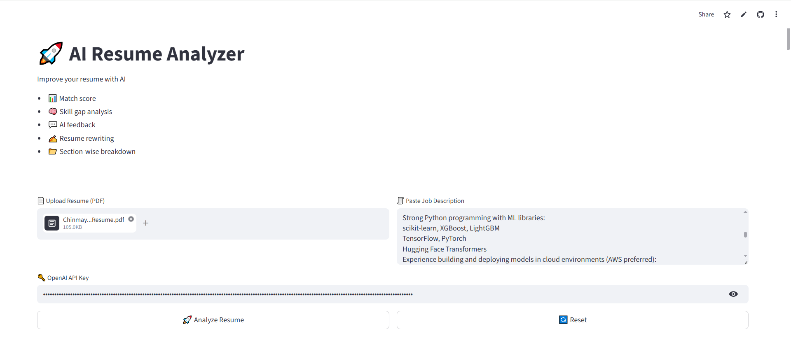
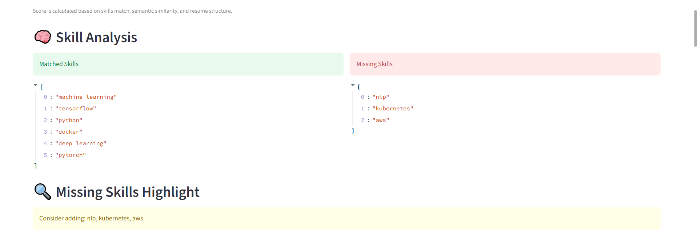
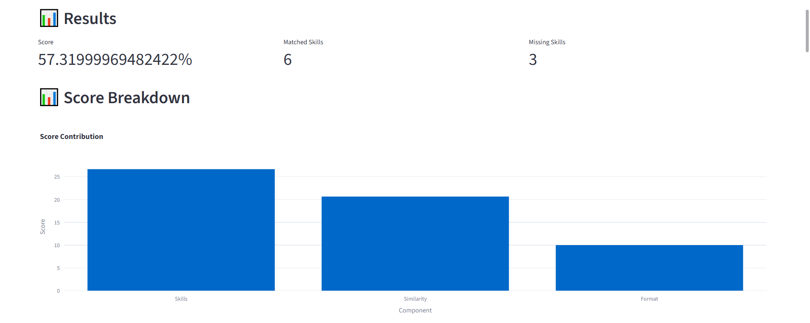

# 🚀 AI Resume Analyzer

An AI-powered application that evaluates resumes against job descriptions and provides **actionable feedback, skill gap analysis, and ATS-style scoring** using Machine Learning and Large Language Models.

🔗 **Live Demo:** https://resume-aianalyzer.streamlit.app/

---

## 📌 Features

* 📄 Upload Resume (PDF)
* 🧾 Paste Job Description
* 📊 Resume Match Score (ATS-style)
* 🧠 Skill Gap Analysis (Matched & Missing Skills)
* 📉 Score Breakdown Visualization
* 💬 AI-Generated Feedback
* ✍️ AI Resume Rewriting Suggestions
* 🔍 Highlight Missing Skills in Resume
* 📂 Section-wise Resume Breakdown
* 📥 Download Resume Report (PDF)

---

## 📸 Screenshots

### 🔹 User Interface

👉 Place this image at: `screenshots/ui.png`



---

### 🔹 Skill Gap Analysis

👉 Place this image at: `screenshots/skill_analysis.png`



---

### 🔹 Result & Feedback Output

👉 Place this image at: `screenshots/result.png`



---

## 🧠 How It Works

The system follows a modular pipeline:

### 1. Resume Parsing

Extracts text from PDF using **pdfplumber**

### 2. Skill Extraction

* Uses predefined skill dictionary
* Applies regex-based matching

### 3. Gap Analysis

Compares resume skills with job description and outputs:

* Matched skills
* Missing skills
* Match percentage

### 4. Semantic Similarity

* Uses **sentence-transformers (MiniLM)**
* Splits resume into chunks
* Finds most relevant sections

### 5. Scoring System

Final score is calculated using:

* Skills Match → 40%
* Semantic Similarity → 40%
* Resume Structure → 20%

### 6. AI Feedback & Rewrite

Using **OpenAI API**:

* Strengths & weaknesses
* Missing skills
* Improvement suggestions
* Resume rewriting

### 7. Visualization

* Score breakdown using **Plotly**

### 8. Resume Highlighting

* Highlights missing skills directly
* Suggests improvements

---

## 🧠 Architecture

Resume → Text Extraction → Skill Extraction → Embeddings → Scoring → LLM → Output

---

## 🏗️ Project Structure

```bash
ai-resume-analyzer/
│
├── app.py
├── config.py
├── requirements.txt
│
├── services/
│   ├── parser.py
│   ├── skills.py
│   ├── gap_analysis.py
│   ├── embeddings.py
│   ├── scorer.py
│   ├── llm.py
│   ├── pdf_exporter.py
│
├── utils/
│   └── text_splitter.py
│
├── screenshot/
│   ├── ui.png
│   ├── skill_analysis.png
│   ├── result.png
```

---

## ⚙️ Installation

```bash
git clone https://github.com/ChinmayShastry/ai-resume-analyzer.git
cd ai-resume-analyzer
pip install -r requirements.txt
streamlit run app.py
```

---

## 🔑 API Key Setup

This app uses OpenAI API for AI features.

Enter your API key in the app UI:

```
OPENAI_API_KEY=your_key_here
```

---

## 🧪 Example Workflow

1. Upload your resume (PDF)
2. Paste a job description
3. Click **Analyze Resume**
4. View:

   * Match Score
   * Skill Gaps
   * AI Feedback
   * Improved Resume
5. Download report

---

## 📊 Tech Stack

* **Frontend:** Streamlit
* **Visualization:** Plotly
* **NLP:** sentence-transformers
* **ML:** scikit-learn
* **LLM:** OpenAI API
* **PDF Processing:** pdfplumber, reportlab

---

## ⚡ Optimizations

* Caching for faster performance
* Chunk-based similarity for better accuracy
* Reduced API calls for cost efficiency
* Modular pipeline design

---

## ⚠️ Limitations

* Rule-based skill extraction (may miss variations)
* Heuristic section detection
* Requires API key for full functionality

---

## 🚀 Future Improvements

* Resume vs Job Matching Score (Enhanced ATS logic)
* Multi-LLM support (Gemini, etc.)
* Advanced NLP-based skill extraction
* Resume ranking across multiple jobs
* Better PDF formatting

---

## 📚 Key Learnings

* Built end-to-end LLM + ML pipeline
* Implemented semantic search using embeddings
* Designed modular and scalable architecture
* Applied prompt engineering for structured outputs

---

## 🎯 Use Cases

* Resume optimization for job seekers
* ATS simulation
* Placement preparation for students
* Resume screening tools

---

## 🤝 Contributing

Feel free to fork the repo and improve it.

---

## ⭐ Final Note

This project combines:

* Rule-based logic
* Machine Learning
* Generative AI

to build a **practical, real-world resume intelligence system**.
